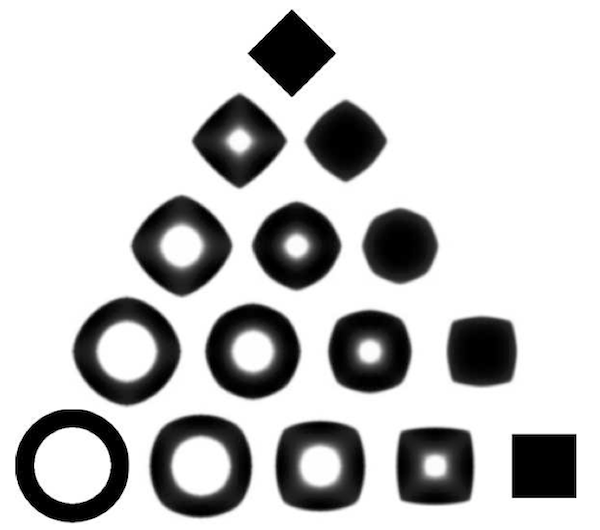

This Matlab package contains the source code to reproduce the figure of the article

  "Iterative Bregman Projections for Regularized Transportation Problems"
  Jean-David Benamou, Guillaume Carlier, Marco Cuturi, Luca Nenna, Gabriel Peyré
  Preprint, 2014.

Each directory contains the code for a specific OT-like problem considered in the article:
* barycenters/: section "Optimal Transport Barycenters"
* constrained/: section "Transport Problems with Inequality Constraints"
* euler/: section "Generalized Euler Flows"
* radon/: section "Partial Radon Inversion with OT Fidelity"

Copyright (c) 2014, Jean-David Benamou, Guillaume Carlier, Marco Cuturi, Luca Nenna, Gabriel Peyré
